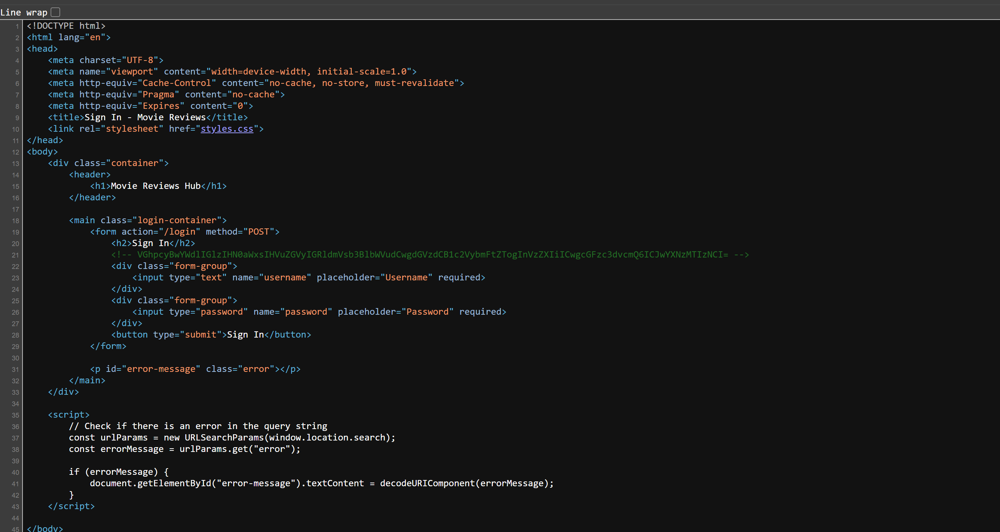
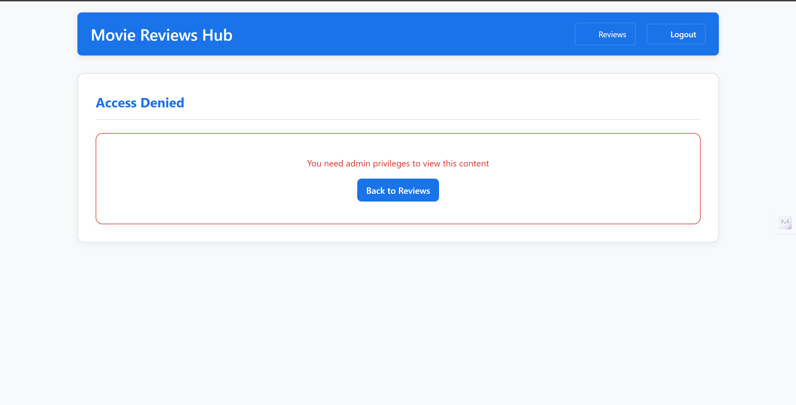
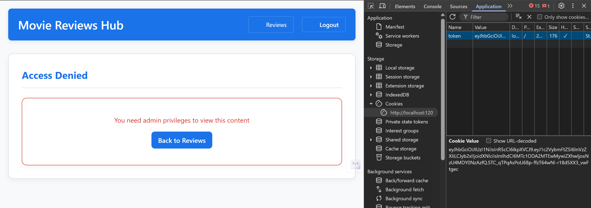
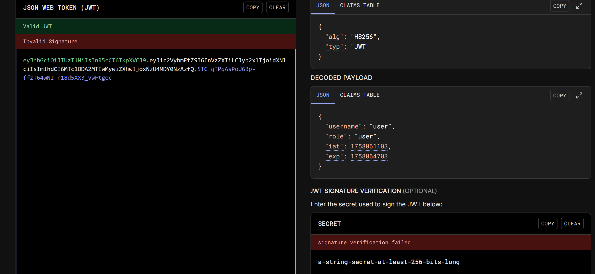
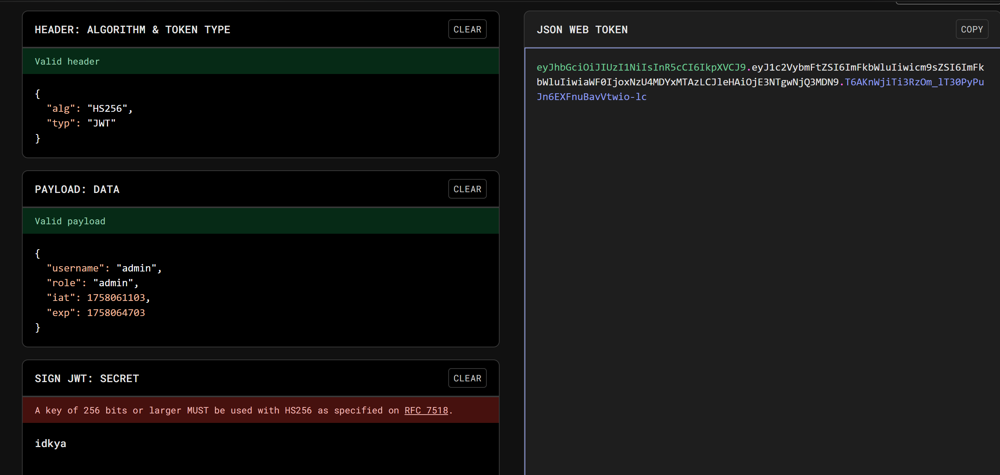
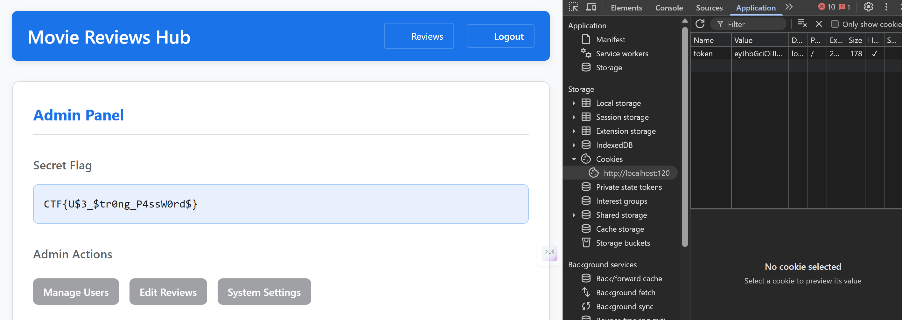

# secret

[Challenge Description - Two Lines Placeholder]

## Solution

### Step 1: Find the Base64 String
1. Open the challenge website in your browser
2. Right-click and select "View page source"
3. Look through the page source for a Base64 encoded string

### Step 2: Decode the Base64 String
1. Copy the identified Base64 string
2. Go to a Base64 decoder (like base64decode.org or CyberChef)
3. Paste the string and decode it to reveal the username and password

### Step 3: Login with Credentials
1. Use the decoded username and password to log into the website
2. Navigate through Admin Panel

### Step 4: Extract the JWT Token
1. Open Developer Tools (right-click → Inspect)
2. Go to the "Application" tab (Chrome) or "Storage" tab (Firefox)
3. Under "Cookies", select the site's domain
4. Locate and copy the JWT token value

### Step 5: Analyze the JWT Token
1. Visit jwt.io
2. Paste the token into the encoded section
3. Examine the decoded payload section
4. Note the values for `name` and `access` (both set to "user")

### Step 6: Crack the JWT Secret
1. Open JWT cracker in Kali Linux (or use jwt_tool)
2. Input the JWT token
3. Start the cracking process to discover the secret key
4. Wait for the tool to reveal the secret value

### Step 7: Forge an Admin Token
1. Return to jwt.io
2. Paste the original JWT token
3. In the payload section, change:
   - `name`: "user" → "admin"
   - `access`: "user" → "admin"
4. Paste the cracked secret into the "Verify Signature" section
5. Copy the newly encoded token

### Step 8: Retrieve the Flag
1. In your browser's Developer Tools (Application/Storage tab)
2. Replace the existing JWT cookie value with your forged admin token
3. Refresh the page or navigate to the flag endpoint
4. The flag should now be displayed on the page

